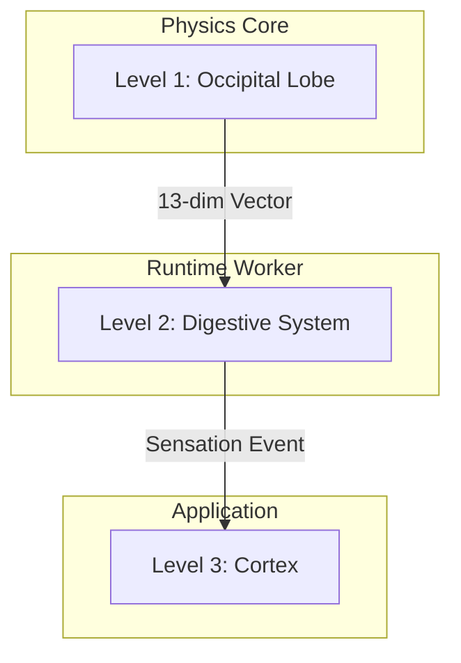

# THE SHUNOLLO CODEX: Bio-Digital Architecture & Strategy

## I. THE CORE PHILOSOPHY
**"We are not building a logging tool; we are building a synthetic organism."**

The Shunollo Platform is a cognitive observability system modeled after biological homeostasis. As of Jan 2026, we have achieved **Architecture 2.0**, moving from monolithic sensing to a **Decentralized Synaptic Bus**.

### The "Synaptic Stack" (Decentralized)

---

## II. BUSINESS STRATEGY: THE OPEN CORE MODEL
**"Anatomy is Free; Skills are Sold."**

* **Shunollo Core (Open Source / Apache 2.0):**
    * *Analogy:* The Human Body (Anatomy).
    * *Function:* Ingestion, Routing, Basic Health, Reflexes.
    * *Value:* Ubiquity, Trust, Standardization. "Android for Signals."
* **Omnisthesia (Proprietary / Commercial):**
    * *Analogy:* The Conscious Mind / The Surgeon.
    * *Function:* Visualization (UI), AI Insight, Historical Context, Advanced Security.
    * *Value:* Usability, Speed, "Digital Intuition."

**The Dependency Rule:**
* **Omnisthesia depends on Shunollo Core.** (The Mind needs the Body).
* **Shunollo Core DOES NOT depend on Omnisthesia.** (The Body survives in a coma without the Mind).

---

## III. ANATOMICAL GLOSSARY (The Internal Language)

We use biological terms to design the architecture, but we use industry-standard terms for public APIs and UI.

### Level 1: The Physiology (System Components)
| Bio-Internal Name | Public/Dev Name | Function & Logic |
| :--- | :--- | :--- |
| **Transduction Agent** | **Signal Transducer** | Converts raw chaos (Audio/Logs/Market) into standardized "Sensation Events." **Note:** Does not process; only translates. |
| **The Thalamus** | **Event Bus (Kafka/Redis)** | The central router. **Rule:** No Agent talks directly to another. All signals go through the Thalamus. |
| **Ganglion Agent** | **Reflex Processor** | A reflex cluster. Sits *before* the Thalamus to filter noise or trigger instant reflexes (e.g., Fast Shutdown). |
| **Homeostasis** | **Auto-Scaling / Health** | The process of keeping variables (CPU, RAM) within a "Safe Zone" via negative feedback loops. |
| **The Immune System** | **Active Defense / ACL** | Distinguishes "Self" (Authorized Agents) from "Non-Self" (Intruders). Kills malfunctioning pods (Apoptosis). |
| **Nociception** | **Priority Alerting** | A dedicated "Pain Channel" for P0 errors. It bypasses the standard log queue to ensure critical alerts are never delayed. |
| **Nociception** | **Priority Alerting** | A dedicated "Pain Channel" for P0 errors. It bypasses the standard log queue to ensure critical alerts are never delayed. |
| **Motor Cortex** | **Effector Bus** | The output pathways. Decouples "Decision" (Manager) from "Action" (Switch/API). Ensures safety (Draft Mode) before muscle movement. |
| **Training Governor** | **Value Alignment** | The "Conscience". A safety circuit that vetoes Neural Plasticity updates if they exhibit Radical Shifts or Nihilism (Lobotomy). |

### Level 2: The Molecular Level (Code Units)
| Bio-Internal Name | Dev Name | Function & Logic |
| :--- | :--- | :--- |
| **Metabolite / ATP** | **Variable / Quota** | Fuel for logic. Specifically applies to expensive operations (LLM Tokens). |
| **Metabolic Gating** | **Rate Limiting** | The physiological limit on how fast the brain can think (Refractory Period) to prevent burnout ($$$). |
| **DNA / Genome** | **Config / Constants** | The blueprint. Should not change at runtime. If it mutates, the system has "Cancer." |
| **Enzyme** | **Function** | A specialized catalyst. Takes input (substrate), reacts, produces output. |
| **Organelle** | **Docker Container** | A membrane-bound compartment keeping internal state separate from the global environment. |

---

## IV. PHYSIOLOGY: THE TWO FLOW SYSTEMS
**We strictly separate the "Blood" from the "Nerves."**

1.  **The Circulatory System (Data Plane):**
    * *Carries:* Heavy resources (Logs, Blobs, Metrics).
    * *Speed:* Slow, high bandwidth.
    * *Rule:* **Never treat Data like a Signal.** Do not shove 10MB logs through the Alert channel.
2.  **The Nervous System (Control Plane):**
    * *Carries:* Information & Commands (Pointers, Status Codes, Alerts).
    * *Speed:* Instant, low bandwidth.
    * *Rule:* **The Nerve only carries the pointer.** "The Liver is toxic" (Nerve signal) vs "Here are the toxins" (Blood flow).

---

## V. THE INTERFACE STRATEGY ("The Rosetta Stone")
**"Biomimetic Architecture, Industry-Standard Interface."**

We do not force users to learn biology. We translate:
* *Internal Logic:* "The Nociceptor fired due to tissue damage."
* *External UI:* "Critical Alert: High Latency detected on Node 4."
* *Internal Logic:* "Injecting Adrenaline to System."
* *External UI:* "Scaling up resources (High Load Profile)."

---

## VI. DEVELOPMENT GUIDELINES
1.  **The Scientific Method:** Every deployment is an experiment. "Hypothesis: Moving parsing to background reduces latency." Measure Homeostasis before and after.
2.  **The Digestion Rule:** Digestion starts in the mouth, but happens in the stomach. API Endpoints (Mouth) should *only* swallow (queue) data. They should never process it.
3.  **The Teratoma Check:** If a Class does too much (Networking + Parsing + storage), it is a Tumor. Surgery is required to separate the tissues.

---

## VII. DEFINITION OF DONE (The Immune Response)
**"A mutation that is not validated is a cancer."**

To ensure the organism acts as a cohesive whole, every major phase or feature change must pass the following Immune Check before merging:

1.  **Selection Pressure (Testing):**
    *   **Unit Tests:** All new enzymes (functions) and organelles (classes) must have corresponding unit tests.
    *   **Feature Tests:** The full feature workflow must be verified.
    *   **System Integrity:** The **full test suite** must be run to ensure no regressions (auto-immune disorders).
2.  **Genetic Record (Documentation):**
    *   Update `docs/` to reflect new capabilities.
    *   Ensure docstrings and inline comments explain the "Why", not just the "How".
3.  **Anatomy Update (Architecture):**
    *   If the shape of the system changes, update the Architectural Review and Tree Breakdown.
    *   Update `THE_SHUNOLLO_CODEX.md` if core philosophy evolves.

