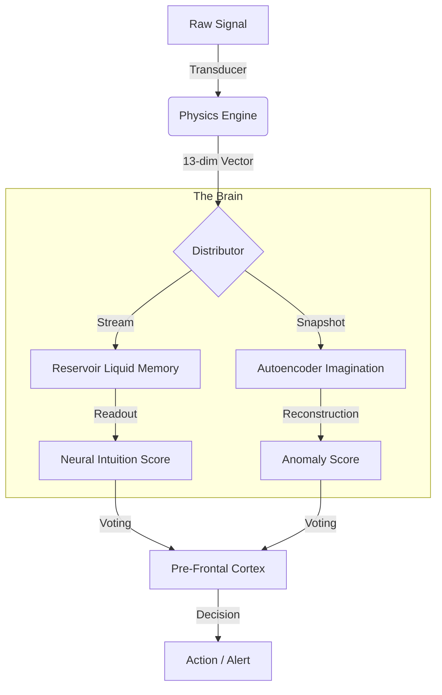

# NEURAL MATHEMATICS: The 3Blue1Brown Correspondence
**Date**: 2026-01-04
**Reference**: [Neural Networks by 3Blue1Brown](https://www.youtube.com/playlist?list=PLZHQObOWTQDNU6R1_67000Dx_ZCJB-3pi)

This document maps the **Shunollo Isomorphic Architecture** directly to the mathematical principles of Neural Networks, ensuring the system is grounded in calculus and linear algebra, not just biological metaphors.

## 1. The Structure ("The Neuro-Symbolic Hybrid")
**Video**: [But what is a neural network?](https://www.youtube.com/watch?v=3JQ3hYko51Y)

Shunollo maximizes efficiency by using a **Hybrid Architecture**:
1.  **Symbolic Layers (Physics)**: Deterministic Math for Pre-processing.
2.  **Neural Layers (Brain)**: Stochastic Networks for Intuition.

| Neural Component | Shunollo Component | Role | Logic |
| :--- | :--- | :--- | :--- |
| **Input Layer** | **Physics Engine** | Vectorization | 13-dim Vector (Energy, Roughness...) |
| **Hidden Layer** | **Reservoir (ESN)** | Temporal Memory | `tanh(W_in*u + W*x)` (Liquid State) |
| **Bottleneck** | **Autoencoder** | Compression | `z = Encoder(x)` (Latent Space) |
| **Output Layer** | **Cortex** | Classification | `y = W_out * x` (Readout) |

### 1.1 Visual Data Flow

**See Also**:
*   [RESERVOIR_COMPUTING.md](RESERVOIR_COMPUTING.md) - Integrating Time.
*   [AUTOENCODER_IMAGINATION.md](AUTOENCODER_IMAGINATION.md) - Integrating Surprise.

---

## 2. Gradient Descent ("The Learning Mechanism")
**Video**: [Gradient descent, how neural networks learn](https://www.youtube.com/watch?v=IHZwWFHWa-w)

Shunollo uses **Online Hebbian-Like Learning**.
Instead of massive offline Backpropagation passes, we use:
1.  **Ridge Regression (Readout)**: The Reservoir's output weights are updated using simple least-squares recurrence.
2.  **Reconstruction Minimization (Imagination)**: The Autoencoder minimizes Mean Squared Error ($MSE$) on the fly using small-batch SGD.

### The Cost Function: $C(w)$
$$Cost = \alpha \cdot (ClassError) + \beta \cdot (ReconstructionError)$$

*   **Class Error**: Did I misclassify this signal?
*   **Reconstruction Error**: Did I fail to imagine this signal?

---

## 3. Backpropagation vs Liquid State
**Video**: [What is backpropagation really doing?](https://www.youtube.com/watch?v=Ilg3gGewQ5U)

Standard Backprop is computationally expensive ($O(N^2)$).
Shunollo avoids generic Backprop through time by using the **Echo State Property**:
*   The internal Reservoir weights ($W$) are **Fixed** and **Random**.
*   Only the Output weights ($W_{out}$) are trained.
*   This makes learning linear and extremely fast—suitable for real-time processing.

---

## 4. The Calculus ("Dynamic Adaptation")
**Video**: [Backpropagation calculus](https://www.youtube.com/watch?v=tIeHLnjs5U8&vl=en)

Neural networks are engines of calculus (Derivatives). Shunollo uses **Rates of Change** ($\frac{dy}{dx}$), not just static values ($y$).

### Static vs. Dynamic
*   **Static (Traditional)**: `if metric > 90% then ALERT`.
    *   *Flaw*: Triggers on slow, safe ramp-ups.
*   **Dynamic (Shunollo)**: `if d(metric)/dt > Threshold then ALERT`.
    *   *Advantage*: Ignores slow creep, catches sudden spikes.

**Application**:
*   **Flux**: The first derivative of volume. $\text{Flux} = \frac{d(\text{Size})}{dt}$.
*   **Acceleration**: The second derivative. $\text{Accel} = \frac{d(\text{Flux})}{dt}$.

By monitoring derivatives, we detect the *force* of a disruption, not just its presence.

---

## 5. The Laws of Energy & Plasticity (Updated 2026)

### 5.1 Kinetic Energy (The Power Law)
Originally modeled as linear, we now use a **Power Law** to correctly model kinetic impact, favoring Velocity (Rate) over Mass (Size):
$$E = m \cdot v^{1.5}$$
*   $m$: Normalized Size (Log Scale)
*   $v$: Normalized Rate

### 5.2 Homeostatic Plasticity (The Energy Budget)
To prevent "Runaway LTP" (Saturation) where every agent trusts everything, we enforce **Normalization**:
$$\sum W_{agents} \approx 0.5 \cdot N_{agents}$$
If one synapse strengthens, others must weaken. The brain has a finite energy budget.

### 5.3 Value Alignment (The Safety Governor)
To prevent "Value Drift" or "Lobotomy", the Governor vetoes gradients that violate safety topology:
$$VETO \iff (\Delta W > 0.3) \lor (\bar{W} < 0.1)$$
*   **Radical Shift**: No single update can shift trust > 30%.
*   **Lobotomy**: System average trust cannot drop below 10%.

*Authorized by Shunollo Core Team.*
