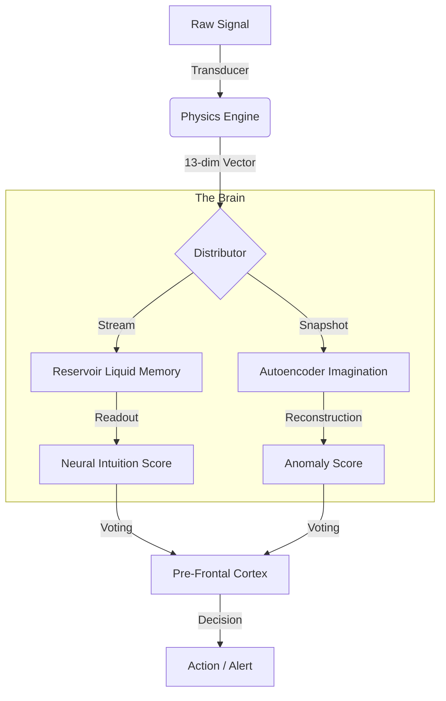

# NEURAL MATHEMATICS: The 3Blue1Brown Correspondence
**Date**: 2026-01-04
**Reference**: [Neural Networks by 3Blue1Brown](https://www.youtube.com/playlist?list=PLZHQObOWTQDNU6R1_67000Dx_ZCJB-3pi)

This document maps the **Shunollo Isomorphic Architecture** directly to the mathematical principles of Neural Networks, ensuring the system is grounded in calculus and linear algebra, not just biological metaphors.

## 1. The Structure ("The Neuro-Symbolic Hybrid")
**Video**: [But what is a neural network?](https://www.youtube.com/watch?v=3JQ3hYko51Y)

Shunollo maximizes efficiency by using a **Hybrid Architecture**:
1.  **Symbolic Layers (Physics)**: Deterministic Math for Pre-processing.
2.  **Neural Layers (Brain)**: Stochastic Networks for Intuition.

| Neural Component | Shunollo Component | Role | Logic |
| :--- | :--- | :--- | :--- |
| **Input Layer** | **Physics Engine** | Vectorization | 13-dim Vector (Energy, Roughness...) |
| **Hidden Layer** | **Reservoir (ESN)** | Temporal Memory | `tanh(W_in*u + W*x)` (Liquid State) |
| **Bottleneck** | **Autoencoder** | Compression | `z = Encoder(x)` (Latent Space) |
| **Output Layer** | **Cortex** | Classification | `y = W_out * x` (Readout) |

### 1.1 Visual Data Flow

**See Also**:
*   [RESERVOIR_COMPUTING.md](RESERVOIR_COMPUTING.md) - Integrating Time.
*   [AUTOENCODER_IMAGINATION.md](AUTOENCODER_IMAGINATION.md) - Integrating Surprise.

---

## 2. Gradient Descent ("The Learning Mechanism")
**Video**: [Gradient descent, how neural networks learn](https://www.youtube.com/watch?v=IHZwWFHWa-w)

Shunollo uses **Online Hebbian-Like Learning**.
Instead of massive offline Backpropagation passes, we use:
1.  **Ridge Regression (Readout)**: The Reservoir's output weights are updated using simple least-squares recurrence.
2.  **Reconstruction Minimization (Imagination)**: The Autoencoder minimizes Mean Squared Error ($MSE$) on the fly using small-batch SGD.

### The Cost Function: $C(w)$
$$Cost = \alpha \cdot (ClassError) + \beta \cdot (ReconstructionError)$$

*   **Class Error**: Did I misclassify this signal?
*   **Reconstruction Error**: Did I fail to imagine this signal?

---

## 3. Backpropagation vs Liquid State
**Video**: [What is backpropagation really doing?](https://www.youtube.com/watch?v=Ilg3gGewQ5U)

Standard Backprop is computationally expensive ($O(N^2)$).
Shunollo avoids generic Backprop through time by using the **Echo State Property**:
*   The internal Reservoir weights ($W$) are **Fixed** and **Random**.
*   Only the Output weights ($W_{out}$) are trained.
*   This makes learning linear and extremely fast—suitable for real-time processing.

---

## 4. The Calculus ("Dynamic Adaptation")
**Video**: [Backpropagation calculus](https://www.youtube.com/watch?v=tIeHLnjs5U8&vl=en)

Neural networks are engines of calculus (Derivatives). Shunollo uses **Rates of Change** ($\frac{dy}{dx}$), not just static values ($y$).

### Static vs. Dynamic
*   **Static (Traditional)**: `if metric > 90% then ALERT`.
    *   *Flaw*: Triggers on slow, safe ramp-ups.
*   **Dynamic (Shunollo)**: `if d(metric)/dt > Threshold then ALERT`.
    *   *Advantage*: Ignores slow creep, catches sudden spikes.

**Application**:
*   **Flux**: The first derivative of volume. $\text{Flux} = \frac{d(\text{Size})}{dt}$.
*   **Acceleration**: The second derivative. $\text{Accel} = \frac{d(\text{Flux})}{dt}$.

By monitoring derivatives, we detect the *force* of a disruption, not just its presence.

---

## 5. The Laws of Energy & Plasticity (Updated 2026)

### 5.1 Kinetic Energy (The Power Law)
Originally modeled as linear, we now use a **Power Law** to correctly model kinetic impact, favoring Velocity (Rate) over Mass (Size):
$$E = m \cdot v^{1.5}$$
*   $m$: Normalized Size (Log Scale)
*   $v$: Normalized Rate

### 5.2 Homeostatic Plasticity (The Energy Budget)
To prevent "Runaway LTP" (Saturation) where every agent trusts everything, we enforce **Normalization**:
$$\sum W_{agents} \approx 0.5 \cdot N_{agents}$$
If one synapse strengthens, others must weaken. The brain has a finite energy budget.

### 5.3 Value Alignment (The Safety Governor)
To prevent "Value Drift" or "Lobotomy", the Governor vetoes gradients that violate safety topology:
$$VETO \iff (\Delta W > 0.3) \lor (\bar{W} < 0.1)$$
*   **Radical Shift**: No single update can shift trust > 30%.
*   **Lobotomy**: System average trust cannot drop below 10%.

## 6. The Physics of Perception (Phase 500)
**Added**: 2026-01-09

To act as a "Universal Sensor Translator," Shunollo implements advanced psychophysics and biophysics models to translate raw data into biologically plausible qualia.

### 6.1 Stevens' Power Law (Psychophysics)
Human perception is non-linear. The relationship between physical intensity ($I$) and perceived sensation ($S$) follows a power law:

$$S = k \cdot I^n$$

Shunollo applies specific exponents ($n$) based on the data domain:
*   **Compression ($n < 1$)**: Brightness (`n=0.33`), Loudness (`n=0.67`). Useful for handling huge dynamic ranges (e.g., Log Volumes).
*   **Linear ($n = 1$)**: Temperature, Length.
*   **Expansion ($n > 1$)**: Electric Shock (`n=3.5`). In IT, **Errors** and **Latency** use this. A small increase in failure rate feels exponentially worse.

### 6.2 Vestibular Integration (Newtonian Dynamics)
The semicircular canals do not measure velocity directly; they measure acceleration and integrate it via fluid dynamics (Steinhausen Model).

$$v(t) = \int a(t) \cdot e^{-\frac{t}{\tau}} dt$$

Shunollo uses this to convert **Rate-Based Anomalies** (e.g., event rate spikes) into **Cumulative State** (Simulated Velocity). This ensures that even after a surge stops, the system remains "dizzy" (alert) until the energy dissipates naturally.

### 6.3 Poisson Statistics (Quantum Detection)
At the lowest threshold of perception (e.g., 5 photons), signals are indistinguishable from noise. We use Poisson statistics to calculate the **Probability of Detection** ($P_d$) against a background dark noise ($\lambda_{noise}$).

$$P(k \ge N) = 1 - \sum_{i=0}^{N-1} \frac{\lambda^i e^{-\lambda}}{i!}$$

This allows Shunollo to detect "micro-anomalies" or "gradual drift" that hides within the system's noise floor.

### 6.4 Von Mises Stress (Continuum Mechanics)
Biological tissue fails due to **Distortion** (shape change), not **Hydrostatic Pressure** (volume change). We use the Von Mises Yield Criterion to analyze multivariate system load.

*   **Uniform Load** (High CPU, High Mem, High Net) = Hydrostatic Pressure = **Healthy Scaling**.
*   **Asymmetric Load** (High CPU, Low Mem, Low Net) = Shear Stress = **Bottleneck/Anomaly**.

$$\sigma_v = \sqrt{\frac{(\sigma_1 - \sigma_2)^2 + (\sigma_2 - \sigma_3)^2 + (\sigma_3 - \sigma_1)^2}{2}}$$

## 7. Phase 2 Biophysics: Transduction Physics (Added 2026-01-09)

Based on "The Physics of Transduction" document, we implement the remaining sensor physics to complete the universal translator.

### 7.1 Chemical Kinetics (Hill-Langmuir & Nernst)
Biological receptors saturate sigmoidally, not linearly. The Hill-Langmuir equation models this saturation:

$$\theta = \frac{[L]^n}{K_d + [L]^n}$$

*   **$K_d$**: Dissociation constant (concentration at 50% saturation).
*   **$n$**: Hill coefficient (cooperativity). $n > 1$ gives a steeper "switch."

The Nernst equation models concentration-driven potentials (battery curves, resource depletion):

$$E = \frac{RT}{zF} \ln \frac{C_{out}}{C_{in}}$$

### 7.2 ThermoDynamics (Arrhenius & Q10)
Reaction rates (and failure rates) depend exponentially on temperature via the Arrhenius equation:

$$k = A e^{-E_a / RT}$$

The $Q_{10}$ coefficient captures the biological sensitivity to temperature. Typical enzymes have $Q_{10} \approx 2$; TRP thermoreceptor channels have $Q_{10} > 10$.

### 7.3 MechanoFilter (Pacinian Corpuscle)
The Pacinian corpuscle is a viscoelastic high-pass filter. It ignores static pressure but responds to texture/vibration:

$$H(s) = \frac{s\tau}{1 + s\tau}$$

This creates "Rapid Adaptation"—the hallmark of change detection. In Shunollo, this distinguishes *sustained load* (safe) from *oscillating load* (concerning).

### 7.4 CriticalResonator (Hopf Bifurcation)
The cochlea operates near a Hopf Bifurcation, providing massive amplification for weak signals:

*   **Weak Signals**: Gain $\rightarrow 1/(2\zeta)$ (can be 50x for $\zeta = 0.01$).
*   **Strong Signals**: Gain is compressed to avoid saturation.

This allows detection *below the thermal noise floor*—something a passive sensor cannot achieve.

*Authorized by Shunollo Core Team.*
